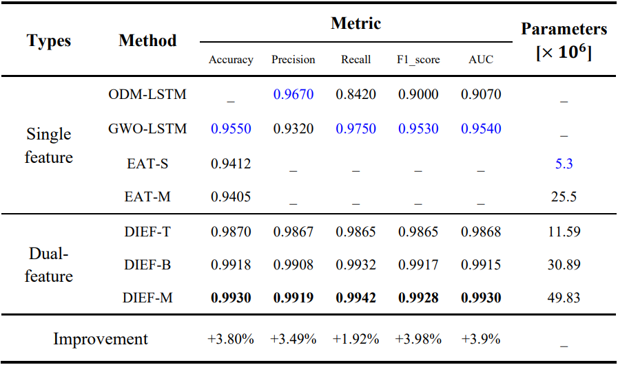

# Lightning-generated whistlers recognition for accurate disaster monitoring in China and its surrounding areas based on the homologous dual-feature information enhancement framework

## :book:Introduction

DIEF is the **first detection framework** to apply **homologous dual features** to lightning-generated whistlers recognition, and it has achieved leading performance on the dataset collected by the Zhangheng-1 satellite. The feature encoder is used to extract feature information, and the time-frequency spectrum features and waveform signal features are integrated through multi-head attention. In this way, two types of features are combined without being limited by the spatial difference in feature information. Moreover, our DIEF achieves advanced performance on the UrbanSound8k dataset.


## :star2:Main Results

Identification results on VLF data collected by the Zhangheng-1 satellite



Identification results on the UrbanSound8k dataset


## :page_facing_up:DataSet

1. [Lightning-generated whistlers](www.leos.ac.cn)
1. [UrbanSound8k](https://www.kaggle.com/datasets/chrisfilo/urbansound8k)

## ⚙️Instalation

1. Clone this project and create a conda environment:

    ```
    git clone https://github.com/KotlinWang/DIEF.git
    cd DIEF
    
    conda create -n dief python=3.9
    conda activate dief
    ```
2. Install pytorch and torchvision matching your CUDA version:
    ```
    conda install pytorch torchvision
    ```

## 🎓 Citation

If you find our work helps, please cite our paper.
    

