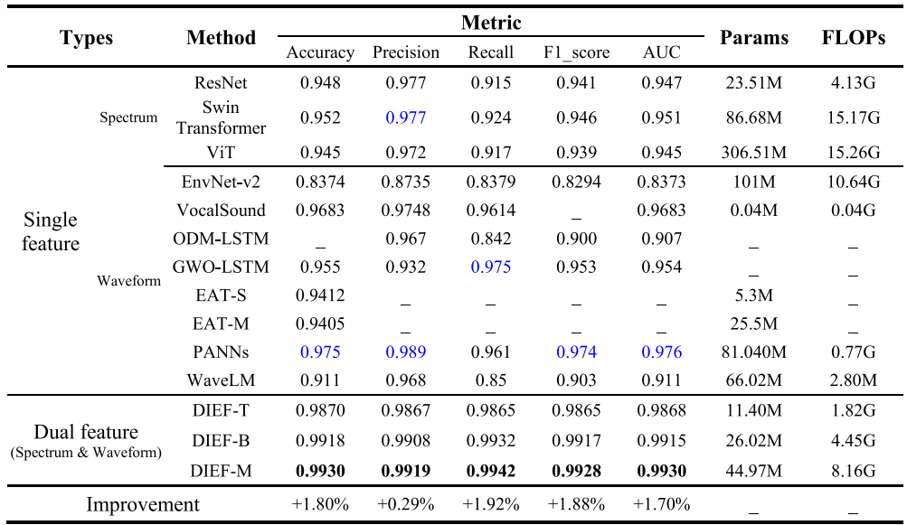
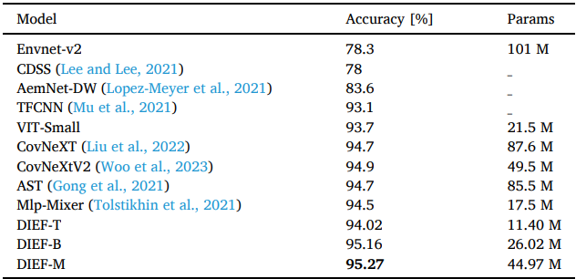

# Lightning-generated whistlers recognition for accurate disaster monitoring in China and its surrounding areas based on the homologous dual-feature information enhancement framework

### [Paper](https://www.sciencedirect.com/science/article/abs/pii/S0034425724000324)

> Lightning-generated whistlers recognition for accurate disaster monitoring in China and its surrounding areas based on the homologous dual-feature information enhancement framework, RSE2024

> [Zijie Wang](https://orcid.org/0009-0006-5989-7475)\*, [Jizheng Yi](https://orcid.org/0000-0002-2360-905X)\* $\dagger$, Jing Yuan, Ronglong Hu, Xiangji Peng, Aibin Chen, Xuhui Shen

\* Equal contribution $\dagger$ Corresponding author

## :newspaper:News

- **[2024/2/4]** DIEF paper is published.
- **[2024/1/26]** DIEF is accepted to RSE2024&#x1F600;!
- **[2023/8/15]** DIEF Project Creation. 

## :rainbow:Visualization

Visualization of Lightning-generated whistlers:

<div align="center">
     </div>

## :book:Introduction

DIEF is the **first detection framework** to apply **homologous dual features** to lightning-generated whistlers recognition, and it has achieved leading performance on the dataset collected by the Zhangheng-1 satellite. The feature encoder is used to extract feature information, and the time-frequency spectrum features and waveform signal features are integrated through multi-head attention. In this way, two types of features are combined without being limited by the spatial difference in feature information. Moreover, our DIEF achieves advanced performance on the UrbanSound8k dataset.

## :star:Overview


- Created with 10,200 lightning-generated whistlers of Zhang heng-1 datasets.
- A homologous dual-feature information enhancement algorithm is proposed.
- Developed three versions of the Dual-feature Information Enhancement Framework (DIEF).
- Two different types of datasets prove the good robustness of our DIEF.

## :star2:Main Results

Identification results on VLF data collected by the Zhangheng-1 satellite:

<div align="center">
    
</div>



Identification results on the UrbanSound8k dataset

<div align="center">
    
</div>

## :page_facing_up:DataSet

1. [Lightning-generated whistlers](www.leos.ac.cn)
1. [UrbanSound8k](https://www.kaggle.com/datasets/chrisfilo/urbansound8k)

## ⚙️Instalation

1. Clone this project and create a conda environment:

    ```
    git clone https://github.com/KotlinWang/DIEF.git
    cd DIEF
    
    conda create -n dief python=3.9
    conda activate dief
    ```
2. Install pytorch and torchvision matching your CUDA version:
    ```
    conda install pytorch torchvision
    ```

## 🎓 Citation

If you find our work helps, please cite our paper:

```@article{WANG2024114021,
title = {Lightning-generated Whistlers recognition for accurate disaster monitoring in China and its surrounding areas based on a homologous dual-feature information enhancement framework},
journal = {Remote Sensing of Environment},
volume = {304},
pages = {114021},
year = {2024},
issn = {0034-4257},
author = {Zijie Wang and Jizheng Yi and Jing Yuan and Ronglong Hu and Xiangji Peng and Aibin Chen and Xuhui Shen},
}
```
